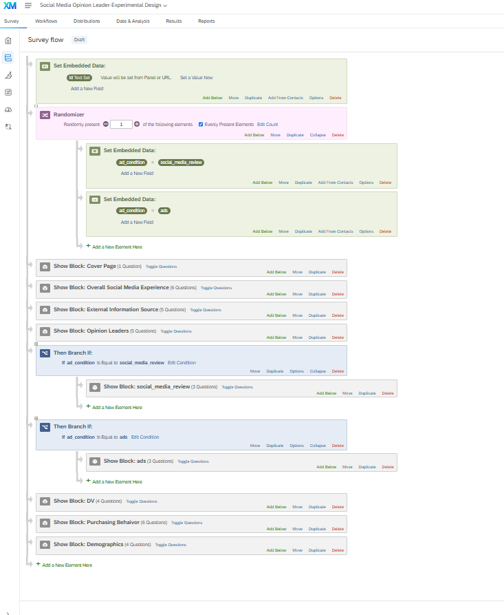
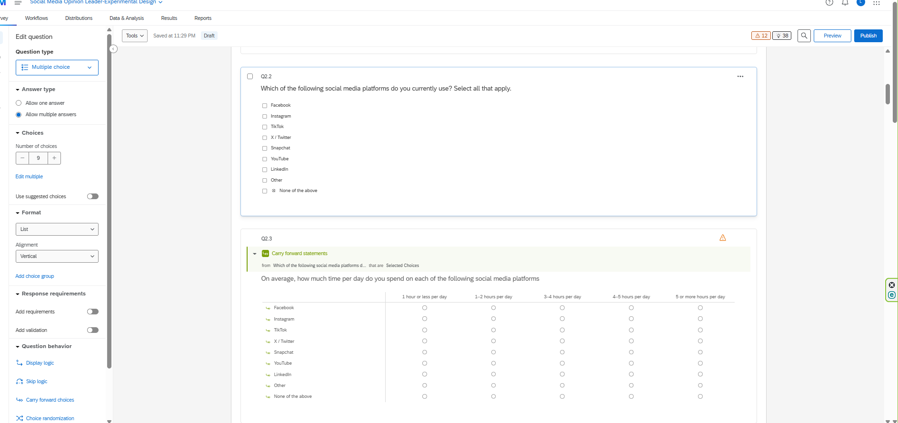
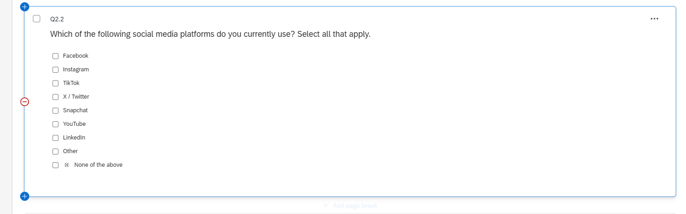
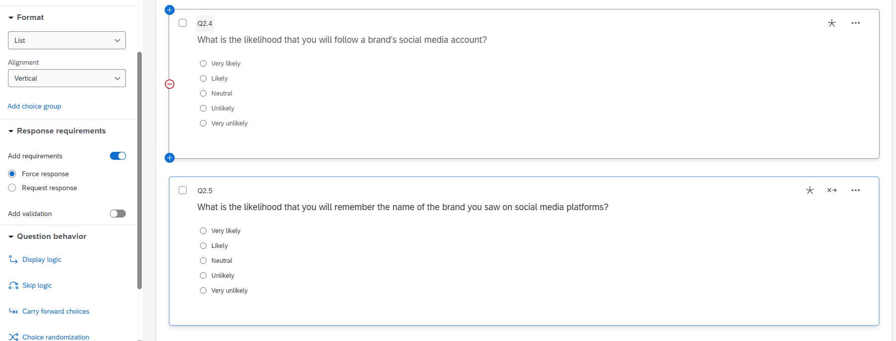
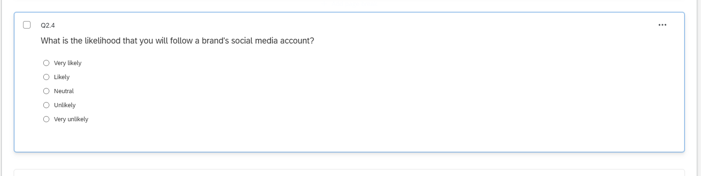

---

---
title: "Qualtrics Assignment #2: Experimental Design"
author: "Luis Ahumada"
date: today
format: 
  html: 
    toc: true
    toc-depth: 4
    number-sections: true
    code-line-numbers: true
    code-fold: false
    code-link: true
    embed-resources: true
editor: visual
execute: 
  freeze: auto
  warning: false
---

## Task 1 – Experimental Design:

I used randomizer to randomly assign participants either social_media_review or ads. I also enabled evenly present elements to make sure both groups had about the same number of participants. Then i added 2 branches so each participant would only see their assigned ad before moving to the DV questions.

## Task 2 – Social Media Usage: 

I changed 2.3 so that participants can select multiple platforms. I also added a matrix question using the carry forward statements so that participants can report how much time they spend on each platform they select.

## Task 3 – Questionnaire Improvements: 

### 

### Improvement 1: 

I added a none of the above option for the question below and made it exclusive so participants couldn't select this answer with other social media platforms. This helps prevent conflicting answers.

### Improvement 2: 

I added force response to the questions below so that participants can't accidentally then. This helps reduce missing answeres and make the data much more complete.

### Improvement 3: 

I removed the numbers from the answer choices to make the question look a lot cleaner and easier to read. This makes it easier for participants to focus on the actual answers without the options being too crowded with a number next to it.

## Appendix: 

[Github Repo](https://github.com/lahumada63/Qualtrics-M02---Setting-up-an-Experimental-Design.git)

[Github HTML](https://lahumada63.github.io/Qualtrics-M02---Setting-up-an-Experimental-Design/)
